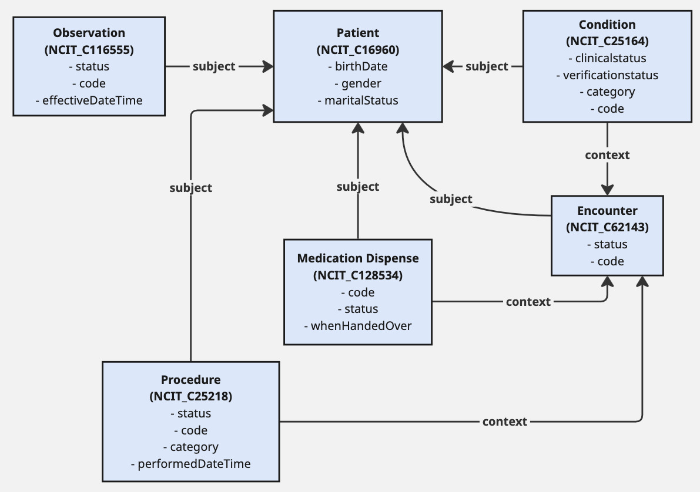

# An ontologised SPARQL endpoint for MomCARE pseudonymised data

This repository provides a Dockerised setup for [Ontop](https://ontop-vkg.org/) with preloaded R2RML mappings and an instance of [DuckDB](https://duckdb.org/) containing a MomCARE sample dataset. It is intended to demonstrate virtual knowledge graph querying using SPARQL over relational data in DuckDB.

The mappings used in this framework are based on an ontologised conceptual model, largely oriented to NCIT terms. An advantage of this approach is that the model can be extended to include other ontologies, which is also reflected in the SPARQL endpoint.

The figure below is a simplified illustration of the conceptual model used in this framework:
<!--  -->


###  Requirements

- **Docker** must be installed on your machine. If you don't have it yet, follow the official installation guide here:  
  [https://docs.docker.com/get-docker/](https://docs.docker.com/get-docker/)

## Quick Start

### 1. Clone the repository

```bash
git clone https://github.com/PharmAccess/momcare_sql_to_rdf.git
cd momcare_sql_to_rdf
```

### 2. Run the docker container
```
docker compose up
```
This will:
-   Start an Ontop SPARQL endpoint
-   Mount the DuckDB database and mapping files
-   Serve the endpoint at `http://localhost:8080/`

### 3. Querying the Data
Once the container is running, you access the SPARQL GUI at `http://localhost:8080/` via your browser.

Examples of queries:
- [List mothers who received a C-section and their age](examples/mothers-c-section.md)
- [List patients that were diagnosed with hypertension during their pregnancy](examples/patients-hypertension.md)

---

### Customisation


**Mappings**: The `DataModel.obda` file contains the mappings used by Ontop. You can open and edit the related OWL file using [Protégé](https://protege.stanford.edu/) for a graphical interface. 

---
####  About Ontop

[Ontop](https://ontop-vkg.org/) allows you to query relational databases as virtual RDF graphs using mappings based on R2RML or OBDA. This approach avoids materialising large RDF datasets and supports efficient, on-the-fly SPARQL querying.

#### About DuckDB

[DuckDB](https://duckdb.org/) is an in-process analytical database management system, ideal for OLAP workloads. This project demonstrates that Ontop can also work with DuckDB as a backend for virtual knowledge graph querying.

#### License
This project is licensed under the **Creative Commons Attribution 4.0 International (CC BY 4.0)** License.  
You are free to share and adapt the material, provided appropriate credit is given.

See the full license text at: https://creativecommons.org/licenses/by/4.0/


## Questions or Contributions?

Feel free to open an issue or submit a pull request. Contributions are welcome!